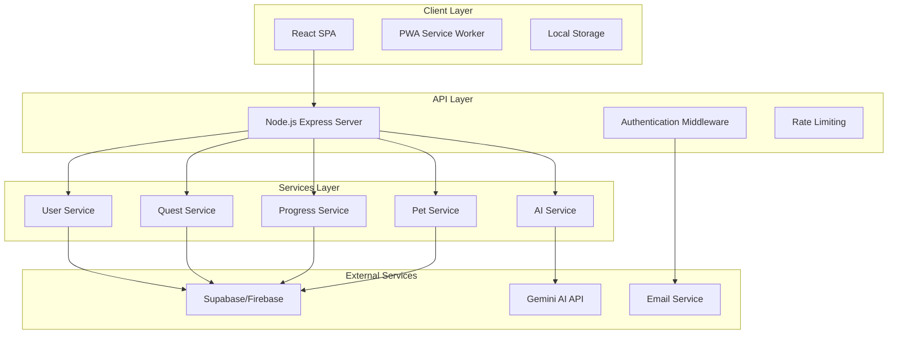
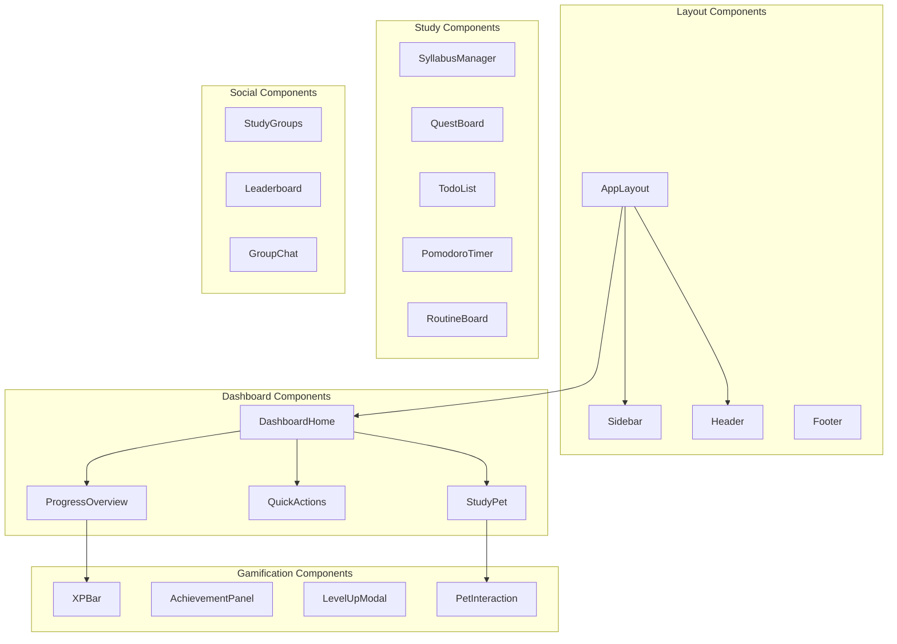
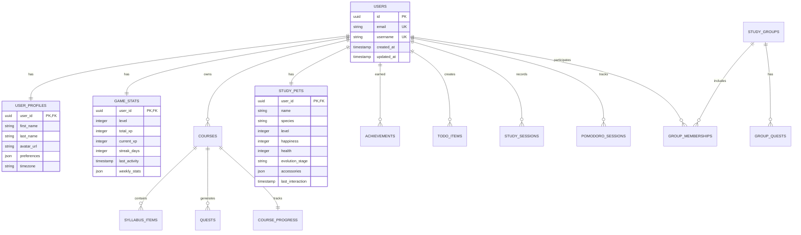
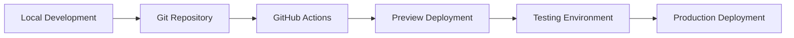

# Design Document

## Overview

The Gamified Study Platform is a modern web application that transforms traditional studying into an engaging, game-like experience. Built with React frontend and Node.js backend, the platform leverages free-tier cloud services to provide a comprehensive study management system with gamification elements, AI integration, and social features.

### Key Design Principles

- **Gamification-First**: Every interaction should provide meaningful feedback and progression
- **Mobile-First Responsive**: Optimized for studying on any device
- **Performance-Oriented**: Fast loading and smooth interactions to maintain focus
- **Accessibility-Compliant**: WCAG 2.1 AA standards for inclusive design
- **Scalable Architecture**: Modular design supporting future feature expansion

## Architecture

### High-Level Architecture



### Technology Stack

**Frontend:**

- **React 18** with TypeScript for type safety
- **Vite** for fast development and building
- **Tailwind CSS** for utility-first styling
- **Framer Motion** for smooth animations and gamification effects
- **React Query** for efficient data fetching and caching
- **Zustand** for lightweight state management
- **React Hook Form** for form handling
- **Chart.js** for progress visualization

**Backend:**

- **Node.js** with Express.js framework
- **TypeScript** for consistent typing across the stack
- **JWT** for authentication
- **Helmet** for security headers
- **Rate limiting** with express-rate-limit
- **Input validation** with Joi or Zod

**Database & Services:**

- **Supabase** (preferred) or Firebase for:
  - PostgreSQL database
  - Real-time subscriptions
  - Authentication
  - File storage
- **Gemini AI API** for intelligent study assistance
- **Nodemailer** with free SMTP for email notifications

**Deployment:**

- **Vercel** or **Netlify** for frontend (free tier)
- **Railway** or **Render** for backend (free tier)
- **GitHub Actions** for CI/CD

## Components and Interfaces

### Core Components Architecture



### Key Interface Definitions

```typescript
// Core User Interface
interface User {
  id: string;
  email: string;
  username: string;
  profile: UserProfile;
  gameStats: GameStats;
  preferences: UserPreferences;
}

interface GameStats {
  level: number;
  totalXP: number;
  currentXP: number;
  xpToNextLevel: number;
  streakDays: number;
  achievements: Achievement[];
}

// Study System Interfaces
interface Course {
  id: string;
  name: string;
  description: string;
  syllabus: SyllabusItem[];
  color: string;
  progress: CourseProgress;
}

interface Quest {
  id: string;
  title: string;
  description: string;
  type: "daily" | "weekly" | "milestone" | "bonus";
  xpReward: number;
  difficulty: "easy" | "medium" | "hard";
  requirements: QuestRequirement[];
  status: "available" | "active" | "completed" | "expired";
  courseId?: string;
}

// Pet System Interface
interface StudyPet {
  id: string;
  name: string;
  species: PetSpecies;
  level: number;
  happiness: number;
  health: number;
  evolution: PetEvolution;
  accessories: PetAccessory[];
  lastFed: Date;
  lastPlayed: Date;
}
```

## Data Models

### Database Schema Design



### Data Storage Strategy

**Supabase Tables:**

- `users` - Core user authentication data
- `user_profiles` - Extended user information
- `game_stats` - XP, levels, achievements
- `courses` - User's courses and syllabi
- `quests` - Generated and custom quests
- `todo_items` - Task management
- `study_sessions` - Time tracking and analytics
- `study_pets` - Virtual pet data
- `study_groups` - Social features
- `achievements` - Gamification rewards

**Real-time Features:**

- Live progress updates during study sessions
- Pet status changes and animations
- Group activity notifications
- Achievement unlocks

## Error Handling

### Frontend Error Boundaries

```typescript
// Global Error Boundary Component
class GlobalErrorBoundary extends React.Component {
  // Catches JavaScript errors in component tree
  // Displays fallback UI with error reporting
  // Logs errors to monitoring service
}

// Feature-Specific Error Boundaries
-StudySessionErrorBoundary -
  PetInteractionErrorBoundary -
  QuestSystemErrorBoundary;
```

### API Error Handling Strategy

```typescript
// Standardized API Error Response
interface APIError {
  code: string;
  message: string;
  details?: any;
  timestamp: string;
  requestId: string;
}

// Error Categories
-ValidationError(400) -
  AuthenticationError(401) -
  AuthorizationError(403) -
  NotFoundError(404) -
  RateLimitError(429) -
  ServerError(500) -
  ExternalServiceError(502);
```

### Offline Handling

- **Service Worker** caches essential app shell
- **Local Storage** maintains critical user data
- **Queue System** for offline actions
- **Sync Strategy** when connection restored
- **Graceful Degradation** for reduced functionality

## Testing Strategy

### Frontend Testing

**Unit Testing (Jest + React Testing Library):**

- Component rendering and interactions
- Custom hooks functionality
- Utility functions
- State management logic

**Integration Testing:**

- API integration with mock services
- User workflows (login, quest completion)
- Gamification system interactions
- Pet system behaviors

**E2E Testing (Playwright):**

- Complete user journeys
- Cross-browser compatibility
- Mobile responsiveness
- Performance benchmarks

### Backend Testing

**Unit Testing (Jest):**

- Service layer functions
- Database operations
- Authentication middleware
- Quest generation algorithms

**Integration Testing:**

- API endpoint functionality
- Database transactions
- External service integrations
- Real-time features

**Load Testing:**

- Concurrent user handling
- Database performance
- API response times
- Memory usage patterns

### Gamification Testing

**Specialized Test Scenarios:**

- XP calculation accuracy
- Level progression logic
- Achievement trigger conditions
- Pet evolution mechanics
- Quest generation algorithms
- Progress tracking precision

## Performance Optimization

### Frontend Optimization

- **Code Splitting** by routes and features
- **Lazy Loading** for non-critical components
- **Image Optimization** with WebP format
- **Bundle Analysis** and tree shaking
- **Memoization** for expensive calculations
- **Virtual Scrolling** for large lists

### Backend Optimization

- **Database Indexing** on frequently queried fields
- **Query Optimization** with proper joins
- **Caching Strategy** with Redis (if needed)
- **Rate Limiting** to prevent abuse
- **Connection Pooling** for database efficiency

### Real-time Features

- **WebSocket Optimization** for live updates
- **Event Batching** to reduce server load
- **Selective Subscriptions** based on user activity
- **Graceful Fallbacks** for connection issues

## Security Considerations

### Authentication & Authorization

- **JWT Tokens** with short expiration
- **Refresh Token** rotation
- **Role-Based Access Control** (RBAC)
- **Session Management** with secure cookies
- **Password Security** with bcrypt hashing

### Data Protection

- **Input Validation** on all endpoints
- **SQL Injection Prevention** with parameterized queries
- **XSS Protection** with content sanitization
- **CSRF Protection** with tokens
- **Rate Limiting** per user and IP
- **HTTPS Enforcement** in production

### Privacy Compliance

- **Data Minimization** - collect only necessary data
- **User Consent** for data processing
- **Data Export** functionality for user rights
- **Data Deletion** with proper cleanup
- **Audit Logging** for security events

## Deployment Architecture

### Development Environment



### Production Deployment

**Frontend (Vercel/Netlify):**

- Automatic deployments from main branch
- Preview deployments for pull requests
- CDN distribution for global performance
- Environment variable management

**Backend (Railway/Render):**

- Container-based deployment
- Automatic scaling based on usage
- Health checks and monitoring
- Database connection pooling

**Database (Supabase):**

- Managed PostgreSQL instance
- Automatic backups
- Real-time subscriptions
- Built-in authentication

## AI Integration Architecture

### Gemini AI Integration

```typescript
// AI Service Interface
interface AIService {
  generateStudyPlan(
    syllabus: string,
    preferences: UserPreferences
  ): Promise<StudyPlan>;
  answerQuestion(question: string, context: StudyContext): Promise<AIResponse>;
  analyzeProgress(progressData: ProgressData): Promise<AnalysisResult>;
  generateQuests(courseContent: CourseContent): Promise<Quest[]>;
  provideFeedback(performance: PerformanceData): Promise<Feedback>;
}
```

**AI Features Implementation:**

- **Context-Aware Responses** using user's current syllabus
- **Personalized Recommendations** based on study patterns
- **Intelligent Quest Generation** from course content
- **Performance Analysis** with actionable insights
- **Natural Language Processing** for syllabus parsing

### AI Safety & Limitations

- **Rate Limiting** for API calls
- **Content Filtering** for appropriate responses
- **Fallback Mechanisms** when AI is unavailable
- **User Privacy** - no sensitive data in AI requests
- **Cost Management** with request optimization

## Gamification System Design

### XP and Leveling System

```typescript
// XP Calculation Formula
const calculateXP = (
  taskType: TaskType,
  difficulty: Difficulty,
  timeSpent: number
) => {
  const baseXP = {
    study_session: 10,
    quest_completion: 25,
    achievement_unlock: 50,
    streak_bonus: 15,
  };

  const difficultyMultiplier = {
    easy: 1.0,
    medium: 1.5,
    hard: 2.0,
  };

  return Math.floor(
    baseXP[taskType] * difficultyMultiplier[difficulty] * (timeSpent / 30)
  );
};
```

### Achievement System

**Achievement Categories:**

- **Study Milestones** - Hours studied, sessions completed
- **Consistency Rewards** - Daily streaks, weekly goals
- **Subject Mastery** - Course completion, quiz scores
- **Social Achievements** - Group participation, helping others
- **Pet Care** - Pet evolution, interaction milestones
- **Special Events** - Seasonal challenges, limited-time goals

### Pet Evolution System

```typescript
interface PetEvolution {
  stage: "egg" | "baby" | "teen" | "adult" | "master";
  requirements: {
    studyHours: number;
    streakDays: number;
    questsCompleted: number;
  };
  unlocks: {
    abilities: string[];
    accessories: string[];
    environments: string[];
  };
}
```

This comprehensive design provides a solid foundation for building an engaging, scalable gamified study platform using modern web technologies and free-tier services.
